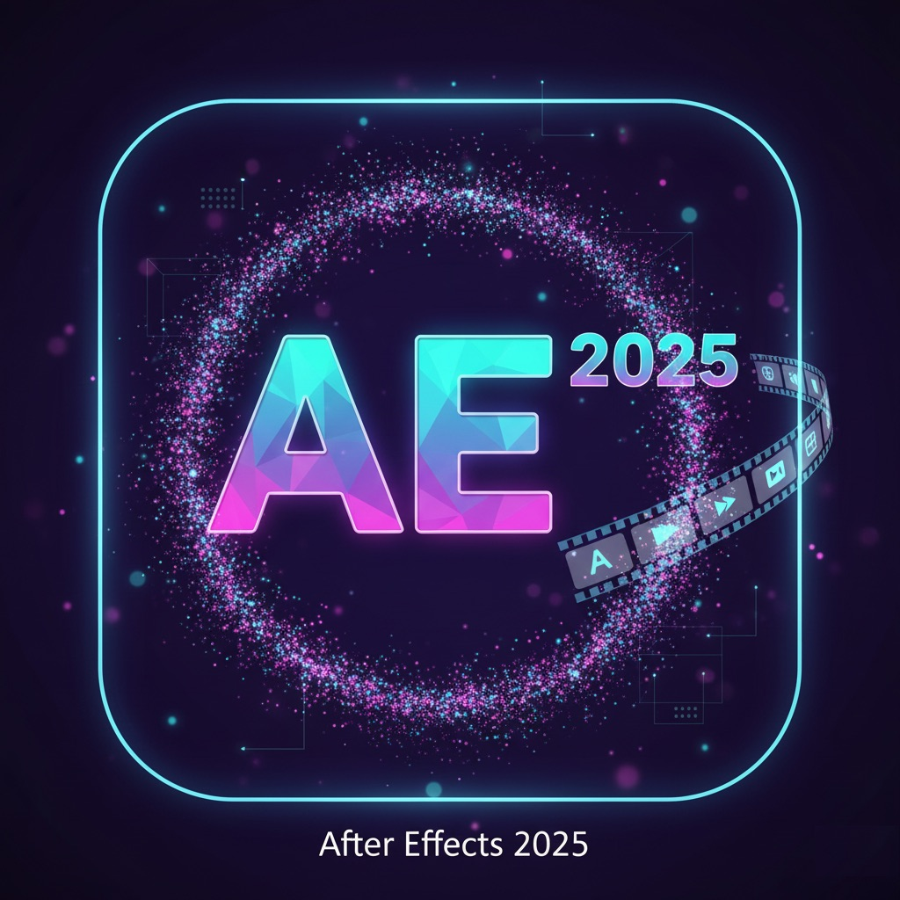

Adobe After Effects 2025: 3D Workflow, VFX, Motion Graphics Upgrade

🌟 Overview

This is your destination for Adobe After Effects 2025!

This new major release revolutionizes your post-production workflow with record-breaking performance gains and cutting-edge new 3D motion design features. Create stunning visual effects, high-end motion graphics, and cinematic 3D designs with simplicity and speed like never before.

✨ Key New Features

The 2025 release focuses on performance, powerful 3D capabilities, and modern color workflows.

🚀 High-Performance Preview Playback

New Cache System: A giant leap in performance with a new cache system utilizing both RAM and local disk.

Smooth Playback: Provides smooth, real-time preview and playback of even the most complex compositions. Say goodbye to constant pausing and waiting!

🧊 Enhanced 3D Workflow

Native FBX Model Support: Import and animate directly from millions of FBX 3D models and integrate them seamlessly into your After Effects 3D space.

Animated Environment Lights: Achieve dynamic, realistic shadows and reflections by surrounding your 3D composition with lights derived from any video, animation, or 360-degree footage.

Shadow Catcher Tool: Meld 3D objects into live-action images with unprecedented realism using the Shadow Catcher tool, which automatically captures and receives shadows synced with your scene's lighting.

🌈 HDR Monitoring & Color Consistency

Accurate HDR Display: Achieve accurate view and monitoring of your work in High Dynamic Range (HDR) for HDR laptops and external reference monitors, ensuring complete mastery of colors and more vivid vibrance.

⚙️ Quality of Life & Workflow Improvements

Customizable Viewer: Customize your workspace with the facility to change the composition viewer color and transparency grids.

Consistent Workspaces: New settings guarantee your workspace and panel layouts are retained when sharing or opening another user's projects.

New Commands: Streamlined one-click operations for complex 3D tasks and new null commands for precise animation control.

🖥️ System Requirements

To ensure optimal performance and take full advantage of the new 3D and high-performance features in After Effects 2025, we recommend the following specifications:

Processor: Multi-core Intel or AMD processor with 64-bit support (10th Gen Intel Core i7 or better recommended).

Operating System: Microsoft Windows 10 (64-bit) V20H2 or later; macOS Big Sur (11.0) or later.

RAM: 32 GB or more (64 GB or more recommended for 4K and 3D compositions).

GPU: 4 GB of GPU VRAM (8 GB or more recommended) and compatible with OpenGL 4.1.

Storage: 15 GB of available hard-disk space for installation; fast internal SSD is required for app installation and disk cache.

🎯 Use Cases
Content 

🚀 Getting Started

🏷️ Keywords (SEO)
adobe after effects, After Effects 2025, AE 2025, vfx, motion graphics, 3d workflow, fbx support, high-performance playback, shadow catcher, hdr monitoring, after effects download, after effects alternative, adobe after effects system requirements
